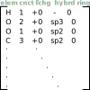
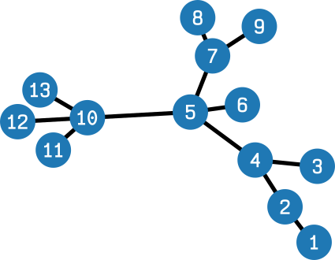

# Theory

## Message-passing Graph Convolution Networks

https://tkipf.github.io/graph-convolutional-networks/

http://www.aritrasen.com/graph-neural-network-message-passing-gcn-1-1/

- Nodes of input graph are featurized
- Message-passing convolution to generate graph's embedding
    + Features of neighbors are mixed in to each node
    + Iterate to capture long-range effects
- Readout processes convolved embedding to make prediction

:::{raw} html

    

        
Molecule

        
    

    
featurization

    

        <ul>
            <li>Feature vectors </li>
            <li>Adjacency matrix</li>
        </ul>
        
        
    

    

    

        
Aggregate

        

        
Activate

        

        
Update

        

    

    

    

        
Neural net

        

        
Post-processing

    

    

    
<em>Prediction</em>

:::

## Charge prediction with the charge equilibration method