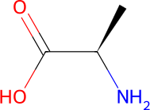
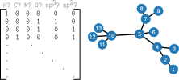
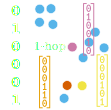
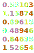
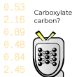
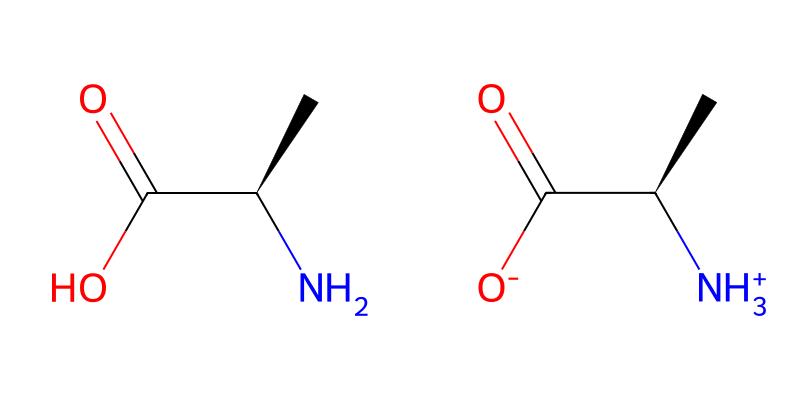

# Theory

(fig:gnnmodel-flowchart)=
:::{raw} html

<figure style="display: block; width: 100%; margin: 0;">
    

        

            
Molecule

            
        

        
featurize

        

            <ul>
                <li>Feature vectors </li>
                <li>Adjacency matrix</li>
            </ul>
            
        

        

        

            
            
Aggregate

            
            
Update

            
            
Iterate with greater hop distance

        

        

        

            
Neural net

            

            
Post-processing

        

        

        
<em>Prediction</em>

    

    <figcaption>
:::
<!-- Markdown caption goes here: -->

Flowchart depicting evaluation of a typical NAGL [model]. An [OpenFF `Molecule`] is ingested and interpreted as a molecular graph. The adjacency matrix is extracted from the graph and the nodes and edges are [featurized]. These data are passed through the convolution module to prepare each atom's embedding; this iterative process consists of aggregating neighbors into a vector, and then passing the aggregate and the current embedding through a neural network to produce a new embedding. This is repeated with more distant neighbors to produce an embedding that the network recognizes as a chemical atom. These embeddings are then passed through a readout neural network to produce physically meaningful predictions, and these predictions are post-processed with chemical knowledge into the desired result.

[OpenFF `Molecule`]: openff.toolkit.topology.Molecule
[featurized]: openff.nagl.features
[model]: openff.nagl.GNNModel

:::{raw} html
    </figcaption>
</figure>
:::

Non-polarizable biomolecular force fields like those produced by OpenFF need fixed partial charges for all their atoms to model long-range non-bonded interactions. Usually, these charges are computed via quantum chemical calculations, but this approach has a few drawbacks:

1. Quantum chemical calculations model conformation-dependent polarization effects, but the same charges will be used for all molecular mechanics configurations
2. QC calculations are computationally expensive, especially for larger molecules
3. QC calculations are complex, require specialized software and domain knowledge, and can be difficult to execute, especially when accounting for the above drawbacks

Most force fields work around this issue by pre-computing and distributing libraries of charges for their target molecules. OpenFF force fields are designed to support a very wide variety of molecules, including those unknown to the developers, so this approach doesn't work. As a result, the slowest computational step in the parametrization of an OpenFF topology is computing partial charges, even when proprietary software is used. For large and unusual molecules like proteins with non-canonical amino acids, neither approach is really workable.

NAGL solves this problem by training machine learning models to predict partial charges - and potentially other properties - from a **molecular graph**. Machine learning describes a wide array of techniques that can produce  a cheap-to-compute approximation to an arbitrary mathematical function by interpolating between example evaluations of the function in a high-dimensional space. This addresses all three drawbacks:

1. Because the input graph is based on the connectivity of the atoms rather than their co-ordinates, the output is conformation-independent (as long as the training data was properly prepared)
2. The model can be evaluated much more quickly than a QC calculation, and scales to large molecules efficiently
3. NAGL can take advantage of the thriving software ecosystem around machine learning, and so can be executed on all sorts of molecules and machines with relative ease

In trade, machine learning models require large datasets of examples of the desired property. As they are at heart interpolations between these examples, the details of the structure of the models and the design of the example datasets are crucial to the production of reliable models. NAGL is designed to make this possible.

:::{admonition} Machine Learning Models in NAGL
NAGL provides the [`GNNModel`] class, which encapsulates an entire family of machine-learned atom property prediction methods. NAGL models are configured, trained, and evaluated through this class.
:::

[`GNNModel`]: openff.nagl.GNNModel

## The Molecular Graph

A molecular graph is essentially a Lewis structure represented as a mathematical graph. A  graph is a collection of **nodes** that are connected by **edges**. Graphs can model lots of everyday systems and objects: in computer networks, computers are nodes and WiFi or Ethernet connections are edges; for an airline, airports are nodes and flights are edges; on Twitter, accounts are nodes and follows are edges. 

In a molecular graph, atoms are nodes and bonds are edges. A molecular graph can store extra information in its nodes and edges; in a Lewis structure, this is things like an atom's element and lone pairs, or a bond's bond order or stereochemistry, but for a molecular graph they can be anything. Element and bond order are usually somewhere near the top of the list. Envisioning a molecule as a graph lets us apply computer science techniques designed for graphs to molecules.

Note that a particular molecular species may have more than one molecular graph topology that represents it. This most commonly happens with tautomers and resonance forms. NAGL operates on molecular graphs, and it doesn't try to be clever about whether two molecules are the same or not. If you want tautomers to produce the same charges, you will need to prepare your dataset and featurization accordingly.

:::{figure-md} fig-diff_graphs

Neutral and zwitterionic alanine. These might be considered the same molecular species, but they are certainly different molecular graphs.
:::

:::{admonition} Molecular Graphs in NAGL
Molecular graphs are provided to NAGL via the [`Molecule`] class of the [OpenFF Toolkit]. These objects can be created in a [variety of ways], but the most common is probably via a [SMILES string] or [.SDF file]. NAGL ingests molecular graphs for inference through the [`GNNModel.compute_property()`] method, and for dataset construction through the [`MoleculeRecord.from_openff()`] and [`MoleculeRecord.from_precomputed_openff()`] methods.
:::

[`Molecule`]: openff.toolkit.topology.Molecule
[SMILES string]: openff.toolkit.topology.Molecule.from_smiles
[.SDF file]: openff.toolkit.topology.Molecule.from_file
[OpenFF Toolkit]: openff.toolkit:index
[variety of ways]: openff.toolkit:users/molecule_cookbook
[`GNNModel.compute_property()`]: openff.nagl.GNNModel.compute_property
[`MoleculeRecord.from_openff()`]: openff.nagl.storage.record.MoleculeRecord.from_openff
[`MoleculeRecord.from_precomputed_openff()`]: openff.nagl.storage.record.MoleculeRecord.from_precomputed_openff

## Featurization

Before we can put a molecule through a neural network, we need a way to represent it with numerical vectors. NAGL uses the molecular graph to break the molecule into nodes and edges, and then represents each node or edge as its own vector. The numbers in these vectors each describe a particular feature of the atom or bond, and so the vectors are called **feature vectors**. The process of encoding an atom or bond as a feature vector is called **featurization**.

When a feature is naturally represented as a continuous numerical value, and the learned function depends on that value in predictable ways, the value may be used as the feature directly. This is generally not the case for molecular graphs. For example, while the element of an atom could be represented by its atomic number, the model would then have to encode some understanding of the periodic table to interpret their chemistry. Instead, the model generally benefits from being able to consider elements as different categories, especially when they are only trained on a subset of the elements. 

NAGL therefore uses **one-hot encoding** for most featurization, in which each feature $f$ represents a property that the atom or bond either has ($f=1$) or lacks ($f=0$). The featurization is therefore like a list of boolean values. For example, the first four features might specify the element of an atom:

- `[1 0 0 0]` represents Hydrogen
- `[0 1 0 0]` represents Carbon
- `[0 0 1 0]` represents Nitrogen
- `[0 0 0 1]` represents Oxygen

This prevents the model from assuming that adjacent elements are similar. Note that these values are represented internally as floating point numbers, not single bits. The model's internal representation is therefore free to mix and scale them as needed, which allows the model to represent a carbon atom (#6) with some oxygen character (#8) without the result appearing like nitrogen (#7).

:::{admonition} Featurization in NAGL
Feature templates for [bonds] and [atoms] are available in the [`features`] module. A featurization scheme is composed of a tuple of instances of these classes, which are passed to the `bond_features` and `atom_features` arguments of the [`GNNModel`] constructor. Most of these features simply apply a one-hot encoding directly to the molecular graph, but a few are built on the [`ResonanceEnumerator`] class to support features that take into account multiple resonance forms.
:::

[bonds]: openff.nagl.features.bonds
[atoms]: openff.nagl.features.atoms
[`features`]: openff.nagl.features
[`ResonanceEnumerator`]: openff.nagl.utils.resonance.ResonanceEnumerator

## Neural Networks - a quick primer

NAGL makes heavy use of the workhorse of machine learning, the **neural network**. A neural network is a machine learning model inspired by the animal brain that can provide [arbitrarily accurate approximations] to a huge variety of mathematical functions. The quality of the approximation depends on the structure and size of the neural network; larger networks are capable of producing better approximations, but require more parameters to describe. Neural networks work just fine on functions that map between vector spaces, and modern computer hardware is well-equipped to compute them efficiently. 

A prepared neural network consists of many computational "neurons" connected to each other as inputs and outputs, a non-linear **activation function** for each neuron that specifies how it transforms its inputs into its outputs, and **parameters** for each neuron that specify how its inputs should be weighted and biased. Usually, the structure of the network and the functional form of the activation function is chosen by the developer, and the parameters are iteratively tweaked until the network reproduces an example dataset of paired inputs and outputs. The process of determining parameters is called **training**; through this process, the network "learns" a function that allows it to reproduce the dataset.

The design of the training dataset is very important; it must include many examples for the network to infer from, but it must also cover the entire space of possible evaluations. Choosing the size of the neural network is also crucial to training a useful model. The network must be large enough to model the underlying function with the desired accuracy, but if the network is too large it will encounter the scourge of machine learning: **overfitting**.

Most real datasets are not perfect reproductions of evaluations of the desired function; there is almost always noise, whether from measurement error or confounding variables or something else. A model is overfitted when it reproduces this noise, rather than just the underlying function. On top of that, any finite training dataset can be perfectly approximated by an infinite number of functions that can do anything they like to inputs missing from the training set. This means that a neural network always interpolates; when the network is overfitted, it "expects" this interpolation to include meaningless noise.

A smaller network that cannot reproduce a highly detailed function is more likely to produce a high quality interpolation rather than invent noise. It is also important to only train a model on a subset of the available data, and use the remaining data (which the model hasn't "seen" before) to evaluate the model. If the model performs as well on the evaluation data as it did during training, it is likely to generalize to other data as well.

:::{admonition} Neural Networks in NAGL
NAGL's neural networks are hidden behind the [`GNNModel`] class, so configuring them generally just involves specifying that class' arguments.
:::

[arbitrarily accurate approximations]: https://www.tivadardanka.com/blog/universal-approximation-theorem

## The Convolution Module: Message-passing Graph Convolutional Networks

NAGL's goal is to produce machine-learned models that can compute partial charges and other properties for all the atoms in a molecule. To do this, it needs a way to represent atoms to the network in their full molecular context. This representation is called an **embedding**, because it embeds all the information there is to know about a particular atom in some relatively low-dimensional space. An atom's feature vector is a simplistic, human-readable embedding, but we want something that a neural network can use to infer charges, even if that means losing simplicity and readability. That means folding in information about the surrounding atoms and their connectivity.

NAGL produces atom embeddings with a message-passing graph convolutional network (GCN). A GCN takes each node's feature vector and iteratively mixes it with those of progressively more distant neighbors to produce an embedding for the node. To start with, NAGL uses an atom's feature vector as its embedding, and its neighbors are the atoms directly bonded to it. On each iteration, the GCN first **aggregates** the feature vectors of an atom's neighbors and the associated bonds, and then **updates** the embedding with the aggregated features of that neighborhood. On the next iteration, the new embedding will be updated again, and the atoms an additional step away will form its new neighborhood.

NAGL's convolution module supports the [GraphSAGE] architecture to train a single neural network to produce an embedding for any atom in any molecule. GraphSAGE uses any of a number of simple mathematical functions for its aggregation step, and trains a neural network to perform the update function. NAGL currently uses simple element-wise averaging of features for its aggregation step, and trains the update network automatically as part of training a model. The update function is thus custom built to produce an embedding for the property we're trying to predict!

:::{admonition} Note
GraphSAGE has nothing to do with the Sage force field!
:::

[GraphSAGE]: https://snap.stanford.edu/graphsage/

## The Readout Module: The Charge Equilibration Method

A trained convolution module takes a molecular graph and produces a representation for each atom that is custom-made for prediction of the desired property. These embeddings are then passed directly to the **Readout module** to predict the properties themselves; in fact, both modules are trained together to optimize their performance.

The readout module consists of a neural network and a **post-processing** function. The post-processing function takes the outputs of the neural network and applies some traditional computation to them before producing the model's final result. NAGL therefore sandwiches its machine learning core between conventional, symbolic computation where chemistry knowledge can be injected.

NAGL uses an interesting application of the post-processing layer when calculating charges: an application of the **charge equilibration method** [inspired by electronegativity equalization]. The readout neural network does not directly infer partial charges; instead, it predicts two variables that are interpreted as **electronegativity** $e$ and **hardness** $s$. These are the first two derivatives in charge of the molecule's potential energy, and respectively quantify the atom's proclivity to hold negative charge and the atom's resistance to changing charge. An atom's partial charge $q$ is then computed from these properties and the molecule's net charge $Q$:

$$
    q = \frac{1}{s} \left(\frac{Q + \sum_i{\frac{e_i}{s_i}}}{\sum_i{\frac{1}{s_i}}} - e\right)
$$

Sums over $i$ represent sums over all atoms in the molecule.

Note that though the neural network only produces estimates of electronegativity and hardness, NAGL models are trained with datasets that map molecular graphs to partial charges. The entire model, from convolution to post-processing, is trained together to produce the best possible charges, *not* the most generally useful or transferable atom embeddings, electronegativities or hardnesses.

:::{admonition} Readout post-processing in NAGL
NAGL's machine learning models can be supplied a post-processing function with the `postprocess_layer` argument of [`GNNModel`].
:::

[inspired by electronegativity equalization]: https://arxiv.org/pdf/1909.07903.pdf
